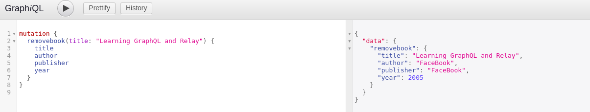

# Extending the example

### Search for a book

Earlier it searched all available books now we will customize it to search only for books we want based on title \(I am not using ID or ISBN as primary key.. it can also be done just minor modifications to schema\)



```javascript
type Query { 
    allbooks: [Book]
    findbookbytitle(title: String!):[Book]
  }
```



Add the resolver



```javascript
findbookbytitle: (root,{title}) => {
      return books.filter(books => {
        return books.title === title;
      })
    },
```





We can also extend the search based on different fields


Search Based on published year will look like this

```javascript
findbookbyyear(year: Int!):[Book]
```

and mutation for that will be as follows

```javascript
 findbookbyyear: (root,{year}) => {
      return books.filter(books => {
        return books.year === year;
      })
    }
```


### Update a Book data

To update an entity first we need to find its index and update its data.

Define the mutation for update



```javascript
updatebook(title: String!, author: String, publisher: String, year:Int): Book   
```




If we don't check undefined value/if new value is not passed for all the fields  then Null assignment is done by default to respective field hence i used if statement


Resolver for update by title of the book



```javascript
updatebook: (root,args) => {
 const index = books.findIndex(books => books.title === args.title);
 if(args.title !== undefined )
 books[index].title = args.title;
 if(args.author !== undefined)
 books[index].author = args.author;
 if(args.publisher !== undefined)
 books[index].publisher = args.publisher;
 if(args.year !== undefined)
 books[index].year = args.year;
 return books[index]
}
```




### Delete a Book based by its title

This is also same process find the index of the book and delete it using `Splice()`

Define the mutation in the schema



```javascript
removebook(title: String!): Book         
```



Define the resolver to delete a Book



```javascript
removebook: (root,args) => {
  const index = books.findIndex(books => books.title === args.title);
  const deletedbook = books[index];
  books.splice(index,1);
  return deletedbook;
 }
```






