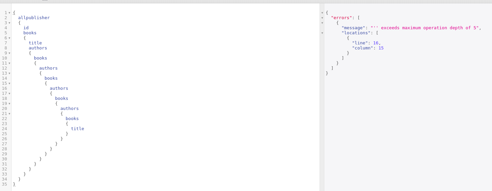

# Fix Em!

### Query Depth

In order to limit Query Depth in our Example we can do some changes to our code and add some constraints on it as follows

Install `graphql-depth-limit` and `express-graphql`



```bash
npm i graphql-depth-limit --save
npm i express-graphql --save
```





```javascript
app.use('/graphql', graphqlHTTP((req, res) => ({
  schema,
  validationRules: [ depthLimit(5) ]
})))
```



Now we will execute same query from previous example and this is what we get




