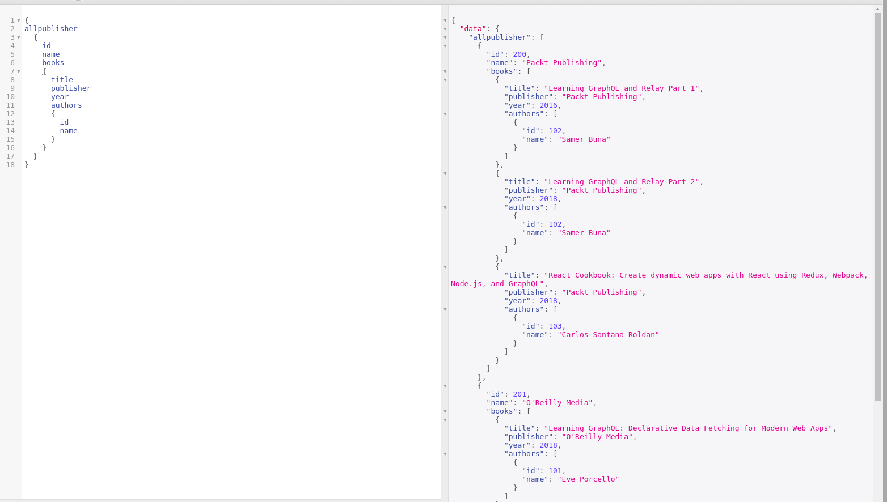

# Nested Queries...

Thought of implementing a 3 level nested query for GraphQL

Example: Start from Publisher, get books related to Publisher and get author information of the book. i.e., Get All the Books of the publisher with the author information of the respective books



```javascript
{
allpublisher
  {
    id
    name
    books
    {
      title
      publisher
      year
      authors
      {
        id
        name
      }
    }
  }
}
```



So Lets add a type Publisher and some data for the Publisher to the example, It can be done as follows



```javascript
type Publisher{id: Int,name: String,books: [Book]}
```





```javascript
const publishers =[
  {
    id: 200,
    name: "Packt Publishing"
  },
  {
    id: 201,
    name: "O'Reilly Media"
  }
];
```



Now write a Query and resolver for the field books in the publisher



```javascript
allpublisher: [Publisher]
```





```javascript
allpublisher: () => { 
      return publishers;
    }
```



Resolving books field of Publisher type



```javascript
Publisher: {
      books(parent, args, ctx, info) {
  
          return books.filter(books => books.publisher === parent.name)
      }
```



Now Publisher and Book got related, next is to relate Book and Author, Previously we related Author to book using name field of the author, But here we use author field of Book type to relate with Author


Apology for weak naming convention of fields


Add authors field of type Author to books and resolve that field later to get relationship to work as follows



```javascript
//.......
//.......
//Modify Query type for the Book

type Book { title: String, author: String, publisher: String, year:Int authors:[Author]}

 //.......
 //.......
 //Add Resolver for the authors field of Book
 
 
 Book: {
    authors(parent, args, ctx, info) {

        return authors.filter(authors => authors.name === parent.author)
    }
```



And when you execute the file you should be able get output as shown below



As we can see now we have _**Packt Publishing's**_ id is 200 and they have _**2 books**_ under their publication and both of them are written by _**Samer Buna.**_


_**As we already related Author to Book we can again use nest for books under author. its ambiguous and confusing but still the relation works!!**_ 




```javascript
{
allpublisher
  {
    id
    name
    books
    {
      title
      publisher
      year
      authors
      {
        id
        name
        books
        {
          title
          year
        }
      }
    }
  }
}
```



