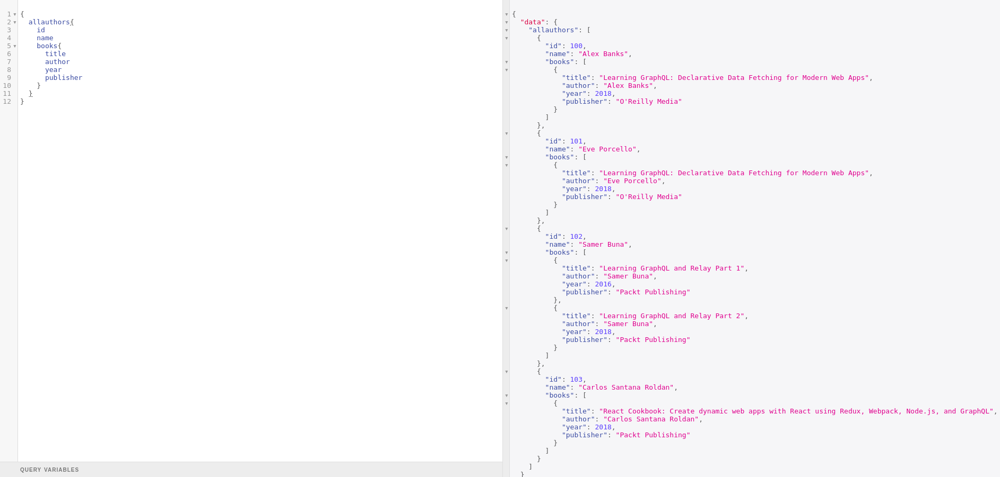
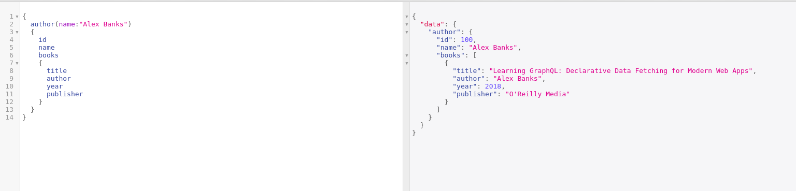
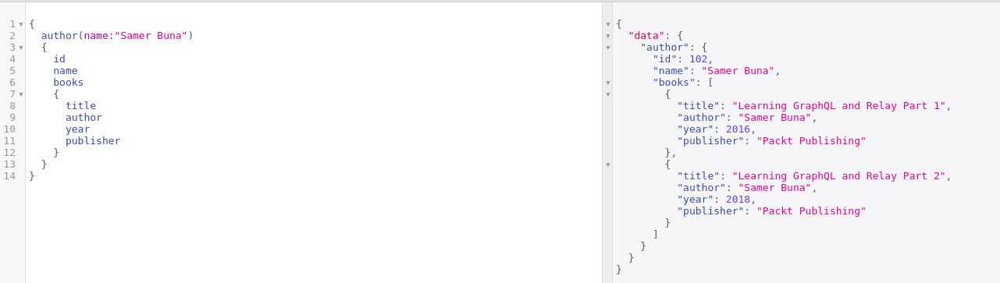

# Nested Queries

Any data you want to get from GraphQL need to have a Query associated by a resolver.

If we want to perform some queries like below then we have do some modification to our example and try to get books written by respective  author like below



```javascript
{
  allauthors{
    id
    name
    books{
      title
      author
      year
      publisher
    }
  }
}
```




unlike previous function call `findbookbyauthor(author:"Samer Buna")` which searched only books for author name we modify it to get both author information and also books written by that author by using **author\(name: String!\)** query, simply we can say that you query author and all of his books in one query.

we add some data of authors as constant in the code



```javascript
const authors=[
{
  id:100,
  name:"Alex Banks"
},
{
  id:101,
  name:"Eve Porcello"
},
{
  id:102,
  name:"Samer Buna"
},
{
  id:103,
  name:"Carlos Santana Roldan"
}
];
```




for now we implement search \(A Strict Searching\) for exact string hence we need to do some modifications to our books data as follows




```javascript
const books = [
  {
    id:1,
    title: "Learning GraphQL: Declarative Data Fetching for Modern Web Apps",
    author: 'Eve Porcello',
    publisher: "O'Reilly Media",
    year: 2018
  },
  {
    id:1,
    title: "Learning GraphQL: Declarative Data Fetching for Modern Web Apps",
    author: 'Alex Banks',
    publisher: "O'Reilly Media",
    year: 2018
  },
  {
    id:2,
    title: 'Learning GraphQL and Relay Part 1',
    author: 'Samer Buna',
    publisher: "Packt Publishing",
    year: 2016
  },
  {
    id:2,
    title: 'Learning GraphQL and Relay Part 2',
    author: 'Samer Buna',
    publisher: "Packt Publishing",
    year: 2018
  },
  {
    id:3,
    title: 'React Cookbook: Create dynamic web apps with React using Redux, Webpack, Node.js, and GraphQL',
    author: 'Carlos Santana Roldan',
    publisher: "Packt Publishing",
    year: 2018
  },
];
```



then we modify the types as follows \(add a field books with type Book\)



```javascript
type Author{id: Int,name: String,books: [Book]} 
```



write a resolver for the author as below



```javascript
allauthors: () => { 
      return authors;
    }
```



Now we need to resolve the books field of type Book in the Author type so we need a resolver as below



```javascript
Author: {
    books(parent, args, ctx, info) {
        console.log(parent)
          //parent is the root object (User is the parent here)

        return books.filter(books => books.author === parent.name)
    }
}
```



and when we execute the file we should get the following output




Try modifying the data and check working of the nested queries


One More modification will be getting a selected author and his information along with his books, we need to add one more resolver and query type for that as below



```javascript
author(name:String): Author
```





```javascript
author(parent, args, ctx, info) {

      if (!args.name) {
          throw new Error('id is required')
      }
      return authors.find(authors => authors.name === args.name)
  }
```



The output will be as below





Final code for this task is below



```javascript
const express = require('express');
const bodyParser = require('body-parser');
const { graphqlExpress, graphiqlExpress } = require('apollo-server-express');
const { makeExecutableSchema } = require('graphql-tools');

// Defined Data
const books = [
  {
    id:1,
    title: "Learning GraphQL: Declarative Data Fetching for Modern Web Apps",
    author: 'Eve Porcello',
    publisher: "O'Reilly Media",
    year: 2018
  },
  {
    id:1,
    title: "Learning GraphQL: Declarative Data Fetching for Modern Web Apps",
    author: 'Alex Banks',
    publisher: "O'Reilly Media",
    year: 2018
  },
  {
    id:2,
    title: 'Learning GraphQL and Relay Part 1',
    author: 'Samer Buna',
    publisher: "Packt Publishing",
    year: 2016
  },
  {
    id:2,
    title: 'Learning GraphQL and Relay Part 2',
    author: 'Samer Buna',
    publisher: "Packt Publishing",
    year: 2018
  },
  {
    id:3,
    title: 'React Cookbook: Create dynamic web apps with React using Redux, Webpack, Node.js, and GraphQL',
    author: 'Carlos Santana Roldan',
    publisher: "Packt Publishing",
    year: 2018
  },
];
const authors=[
{
  id:100,
  name:"Alex Banks"
},
{
  id:101,
  name:"Eve Porcello"
},
{
  id:102,
  name:"Samer Buna"
},
{
  id:103,
  name:"Carlos Santana Roldan"
}
];


// The GraphQL schema in string form
const typeDefs = `
type Book { title: String, author: String, publisher: String, year:Int }
type Author{id: Int,name: String,books: [Book]}  
type Query { 
    allauthors:[Author]
    allbooks: [Book]
    author(name:String): Author
    findbookbytitle(title: String!):[Book]
    findbookbyauthor(author: String!):[Book]
    findbookbypublisher(publisher: String!):[Book]
    findbookbyyear(year: Int!):[Book]
  }
  type Mutation { 
    addbook(title: String, author: String, publisher: String, year:Int): Book 
    updatebook(title: String!, author: String, publisher: String, year:Int): Book   
    removebook(title: String!): Book
    createAuthor(id: ID!, name: String!): Author         
                }
`;

// The resolvers
const resolvers = {
  //Query the available books
  Query: { 
    allauthors: () => { 
      return authors;
    },
    author(parent, args, ctx, info) {

      if (!args.name) {
          throw new Error('id is required')
      }
      return authors.find(authors => authors.name === args.name)
  },
    allbooks: () => { 
      return books;
    },
    findbookbytitle: (root,{title}) => {
      return books.filter(books => {
        return books.title === title;
      })
    },
    findbookbyauthor: (root,{author}) => {
      return books.filter(books => {
        return books.author === author;
      })
    },
    findbookbypublisher: (root,{publisher}) => {
      return books.filter(books => {
        return books.publisher === publisher;
      })
    },
    findbookbyyear: (root,{year}) => {
      return books.filter(books => {
        return books.year === year;
      })
    },
  }, 
  Author: {
    books(parent, args, ctx, info) {
        //Use Parent argument as Author is the parent here for books
        return books.filter(books => books.author === parent.name)
    }
},
  //Mutation to add new book
  Mutation: {   
      addbook: (parent,args)=> {
        //get data from arguments
          const Book = {
              title: args.title,
              author: args.author,
              publisher: args.publisher,
              year: args.year
          }
          books.push(Book) //Push data to GraphQL
          return Book
},
updatebook: (root,args) => {
 const index = books.findIndex(books => books.title === args.title);
 if(args.title !== undefined )
 books[index].title = args.title;
 if(args.author !== undefined)
 books[index].author = args.author;
 if(args.publisher !== undefined)
 books[index].publisher = args.publisher;
 if(args.year !== undefined)
 books[index].year = args.year;
 return books[index]
},
removebook: (root,args) => {
  const index = books.findIndex(books => books.title === args.title);
  const deletedbook = books[index];
  books.splice(index,1);
  return deletedbook;
 },
}
};

// Putting all together
const schema = makeExecutableSchema({
  typeDefs,
  resolvers,
});

// Initialize the app
const app = express();

// The GraphQL endpoint
app.use('/graphql', bodyParser.json(), graphqlExpress({ schema }));

// GraphiQL, a visual editor for queries
app.use('/graphiql', graphiqlExpress({ endpointURL: '/graphql' }));

// Start the server
app.listen(3000, () => {
  console.log('Go to http://localhost:3000/graphiql to run queries!');
});
```



