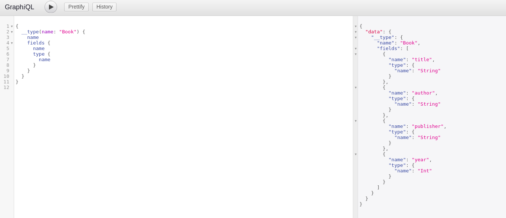

# Security

### Availability issues

GraphQL empowers client side application which makes them a kind of masters who can create own **complex queries** to fetch data can manipulate data, but this flexibility also adds a need for security within the application as complex queries can become time complex and can overload the server, and if the same queries are used by an attacker then the legitimate clients will starve forever to get data and complete the task in turn which will result in slowing down the application or getting service unavailable status all the time.

* GraphQL overcomes this problem by using timeout concept, where server is not worried about query complexity, instead it works in timed fashion for each query until query reaches its maximum execution time after which it will be suspended by making other client/query to get chance to execute.

By understanding GraphQL schema using Introspection method a client can create its own **query depth** is also one important factor which has to be considered during data fetch operation as too much depth in a query can make application sluggish.



```graphql
query library {
  book(id: "abc") {
    author {
      contact {
        phone {
          mobile {
            number
          }
        }
      }
    }
  }
}
```



* By enabling query dept option in GraphQL application we can prevent client from reaching unwanted query depths.

Designing schema for GraphQL can vary from simple to complex structure and the based on type and data the fields or functions might get complex data structure, by assigning query complexity level using simple numbers and preventing **complex queries** for consuming more time as a evil client can use complex queries to abuse the applications.


Query Depth check and complexity check will stop query as soon as the request arrives fro processing.


What happens when a evil client who is smart enough and who starts abusing GraphQL application with  too many requests which contain small/medium sized queries,which have less depth level and less complex data fields?

Above mentioned scenario is also time attack on the GraphQL server but GraphQL uses classic Leaky Bucket algorithm which delays client requests based on number of failed attempts to fetch data and this will increase if client does frequent access. this we can consider as prevention against DOS attack on GraphQL server


To design effective GraphQL application one should consider 

* Analyzing Query complexity
  * Based on time it consumes
  * Based on fields it is using
* Query Depth
* Query frequency \(Rate limiting requests\)


### Integrity issues

GraphQL uses HTTP connection which means intercepting GraphQL communication channel will lead to information disclosure and also MITM attack can inject/modify data which raises question on integrity of the GraphQL application.

GraphQL service should run on HTTPS service, Use strong authentication and authorization procedure to make sure communication secure and service is used only by client which is eligible to get it.

### Introspection attack

GraphQL ecosystem uses its own type system which is defined on top a programming language and database, by this it provides client a chance to understand its schema using introspection queries, if used in harm ways it will display entire schema including data types, functions, enumerations etc.. which helps an attacker by providing large attack surface. it becomes more severe as GraphQL deprecated fields can be queried at root level and server caching feature also adds one more flaw to existing system

some examples:



Stop using Common name for GraphQL interface like `graphql, graphiql,graphql-playground` etc..

Complete understanding of the GraphQL application and its underlying Databases we can implement SQL injection attacks on GraphQL queries. IDOR or Broken Authentication also introduced if GraphQL is not properly mapped on top of existing system

