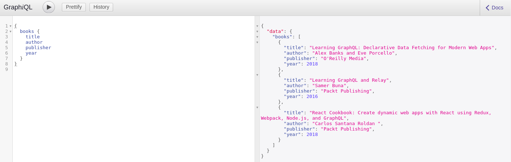

# Simple Example

* [ ] Install NodeJS
* [ ] Install Apollo Server
* [ ] Install GraphQL - GraphQL tools, body parser,, etc..
* [ ] Write GraphQL schema
* [ ] Write resolver
* [ ] Combine all features in Application
* [ ] Execute the application and test


#### Install NodeJS


Download NodeJS : [https://nodejs.org/en/download/](https://nodejs.org/en/download/) Installing NodeJS : [https://github.com/nodejs/help/wiki/Installation](https://github.com/nodejs/help/wiki/Installation)


#### Install Express and create project folder

```bash
mkdir testapp
cd testapp
npm init
npm install express --save
```


_**`use sudo if permission is denied for installing a package`**_

_npm init_ creates a `package.json` file which holds all the dependencies for the application and you can also provide the following information to the file during the creation

1. `package name: (testapp)` 
2. `version: (1.0.0) description:` 
3. `entry point: (index.js)` 
4. `test command:` 
5. `git repository:` 
6. `keywords:` 
7. `author:` 
8. `license: (ISC)` 
9. `About to write to /home/tiger/testapp/package.json:`


#### Installing Dependencies - Apollo and GraphQL to the application




```bash
npm install apollo-server apollo-server-express --save
```






```bash
npm install express graphql graphql-tools body-parser --save
```





```text
{
  "name": "testapp",
  "version": "1.0.0",
  "description": "",
  "main": "index.js",
  "scripts": {
    "test": "echo \"Error: no test specified\" && exit 1"
  },
  "author": "",
  "license": "ISC",
  "dependencies": {
    "apollo-server": "^2.4.8",
    "apollo-server-express": "^1.4.0",
    "body-parser": "^1.18.3",
    "express": "^4.16.4",
    "graphql": "^14.1.1",
    "graphql-tools": "^4.0.4"
  }
}
```



Create /Update src/index.js file with following code



```javascript
const express = require('express');
const bodyParser = require('body-parser');
const { graphqlExpress, graphiqlExpress } = require('apollo-server-express');
const { makeExecutableSchema } = require('graphql-tools');

// data
const books = [
  {
    title: "Learning GraphQL: Declarative Data Fetching for Modern Web Apps",
    author: 'Alex Banks and Eve Porcello',
    publisher: "O'Reilly Media",
    year: 2018
  },
  {
    title: 'Learning GraphQL and Relay',
    author: 'Samer Buna',
    publisher: "Packt Publishing",
    year: 2016
  },
  {
    title: 'React Cookbook: Create dynamic web apps with React using Redux, Webpack, Node.js, and GraphQL',
    author: 'Carlos Santana Roldan ',
    publisher: "Packt Publishing",
    year: 2018
  },
];

// The GraphQL schema in string form
const typeDefs = `
  type Query { books: [Book] }
  type Book { title: String, author: String, publisher: String, year:Int }
`;

// The resolvers
const resolvers = {
  Query: { books: () => books },
};

// Putting all together
const schema = makeExecutableSchema({
  typeDefs,
  resolvers,
});

// Initialize the app
const app = express();

// The GraphQL endpoint
app.use('/graphql', bodyParser.json(), graphqlExpress({ schema }));

// GraphiQL, a visual editor for queries
app.use('/graphiql', graphiqlExpress({ endpointURL: '/graphql' }));

// Start the server
app.listen(3000, () => {
  console.log('Go to http://localhost:3000/graphiql to run queries!');
});
```



save the file and start node by command `node index.js` and open browser and open URL [http://localhost:3000/graphiql](http://localhost:3000/graphiql)

This is what you get!




